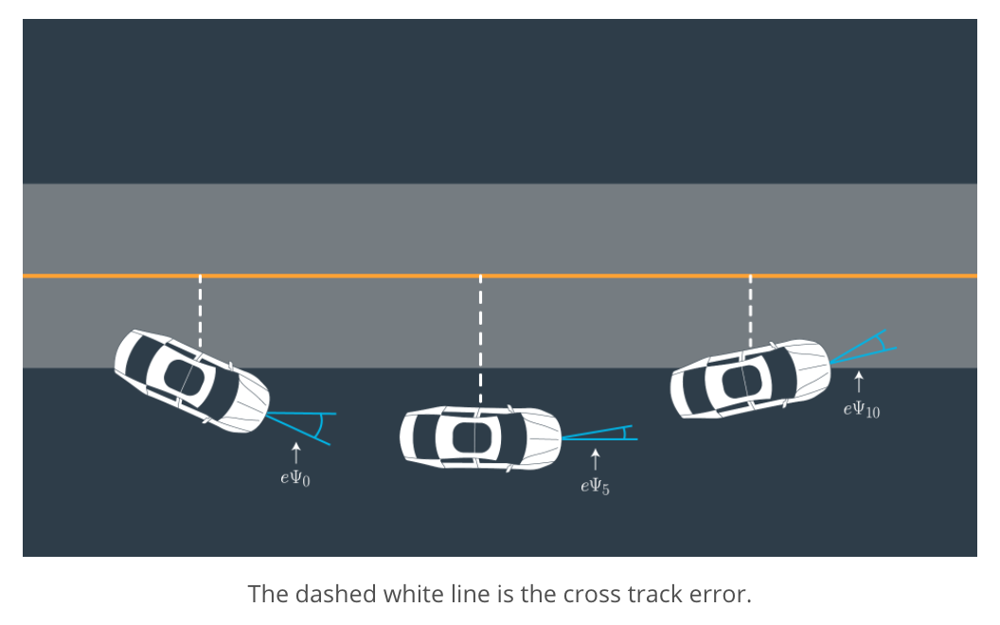

# Additional resources

https://sites.google.com/site/mpclaboratory/mpc-course-material  
https://github.com/JuliaMPC  
https://github.com/MPC-Berkeley  
https://web.stanford.edu/group/sisl/k12/optimization/#!index.md  
https://github.com/sisl/aa222-notebook  

  
# CarND-Controls-MPC
Self-Driving Car Engineer Nanodegree Program

[//]: # (Image References)
[image1]: ./MPC_images/pipeline.png
[image2]: ./MPC_images/state.png
[image3]: ./MPC_images/errors.png
[image4]: ./MPC_images/minimization.png
[image5]: ./MPC_images/solver_setup.png
[image6]: ./MPC_images/solver_in.png
[image7]: ./MPC_images/solver_out.png
[image8]: ./MPC_images/solver_actuate.png
[image9]: ./MPC_imagestest5_result.png

## Description

<p align="center">
     
     <br>pipeline.png
</p>

This project deals with the last stage of an autonomous driving pipeline: the control module.  
The input to the control module will be provided by the output of the path planning module via a set of waypoints to follow as close as possible.  
The control module will have to provide the actuators commands (in our case steering angle and throttling; acceleration or deceleration) so that the automated driving comply with a set of rules:  
* follow the planned waypoints as close as possible
* drives smoothly
* try to adjust the speed: as fast as a configurable reference when possible and driving more slowly during curves  

### Model

The state variables are the following:

<p align="center">
     
     <br>stae.png
</p>

* px: x position
* py: y position
* psi: angle between speed vector and x-axis
* v: speed vector magnitude

The errors variables are the following:

<p align="center">
     
     <br>errors.png
</p>

* cte: cross track error. It corresponds to distance of vehicle from the planned trajectory (as planned by path planning module)  
* epsi: is the angle difference of the vehicle trajectory with the planned trajectory (as planned by path planning module)  

The new state is [x, y, ψ, v, cte, eψ].  

A simple kinematic model is used. Kinematic models are simplifications of dynamic models that ignore tire forces, gravity, and mass. This simplification reduces the accuracy of the models, but it also makes them more tractable. At low and moderate speeds, kinematic models often approximate the actual vehicle dynamics.  

```cpp
          px[t+dt] = px[t] + v[t] * cos(psi[t]) * dt;
          py[t+dt] = py[dt] + v[t] * sin(psi[t]) * dt;
          psi[t+dt] = psi[t] - v[t] * delta[t] / Lf * dt;
          v[t+dt] = v[t] + a[t] * dt;
          cte[t+dt] = cte[t] + v[t] * sin(epsi[t]) * dt;
          epsi[t+dt] = epsi[t]+ v[t] * delta[t] / Lf * dt;
```

The cost function we use accounts for different goals:  
* minimize cte error  
* minimize epsi error  
* try to reach a target speed (ref_v)  
* minimize the use of actuators  
* ensure a smooth drive  

In the below cost function we are setting a very big weight for cte and epsi error minimization.  
As a consequence, while driving, we can see that the driving is safe: the vehicle slows down during the curves and then accelerates mainly when the road is straight. So we can reach a high speed at some point but drive safely in the curves.  

```cpp
    double ref_v = 120;
    
    // The cost is stored is the first element of `fg`.
    // Any additions to the cost should be added to `fg[0]`.
    fg[0] = 0;

    // Reference State Cost
    // TODO: Define the cost related the reference state and
    // any anything you think may be beneficial.
    for (size_t t = 0; t < N; t++) {
      fg[0] += 4 * 2000 * CppAD::pow(vars[cte_start + t], 2);
      fg[0] += 4 * 2000 * CppAD::pow(vars[epsi_start + t], 2);
      fg[0] += CppAD::pow(vars[v_start + t] - ref_v, 2);
    }

    // Minimize the use of actuators.
    for (size_t t = 0; t < N - 1; t++) {
      fg[0] += 5 * CppAD::pow(vars[delta_start + t], 2);
      fg[0] += 5 * CppAD::pow(vars[a_start + t], 2);
    }

    // smooth
    for (size_t t = 0; t < N - 2; t++) {
      fg[0] += 200 * CppAD::pow(vars[delta_start + t + 1] - vars[delta_start + t], 2);
      fg[0] += 10 * CppAD::pow(vars[a_start + t + 1] - vars[a_start + t], 2);
    }
```

<p align="center">
     
     <br>minimization.png
</p>

### Timestep Length and Elapsed Duration (N & dt)

N=10 and dt=100ms are used so that we are working on 1 second of data.  
This is a trade-off: we need enough data visibility to ensure a good prediction, but we also have to limit the amount of computation.  
In general, smaller dt gives better accuracy, but that will require higher N for given horizon (N*dt). However, increasing N will result in longer computational time which increases the latency. The most common choice of values is N=10 and dt=0.1 but anything between N=20, dt=0.05 should work.  


<p align="center">
     
     <br>solver_setup.png
</p>

To summarize: we are solving a non-linear minimization problem. Trying to minimize a defined cost function given a set of constraints (provided by the state equations and actuators constraints) over a discretized set of N time steps (one step every dt seconds).   

### Polynomial Fitting and MPC Preprocessing

Waypoints populated by the path planning module are transformed into the vehicle coordinate system.   
First, we do -Translation(px, py) and then multiply [x, y] by the inverse of the Rotation matrix(psi) of the vehicle.    
```cpp
          // tranform to vehicule coordinates
          for (size_t i = 0; i < ptsx.size(); i++) {
            double x = ptsx[i] - px;
            double y = ptsy[i] - py;

            xvals[i] = x * cos(-psi) - y * sin(-psi);
            yvals[i] = x * sin(-psi) + y * cos(-psi);
          }
```
Then a 3rd order polynomial fit is used to approximate the planned trajectory. 
```cpp
 auto coeffs = polyfit(xvals, yvals, 3);
```

The state vector for the vehicle in vehicle coordinate system is:  
* px = 0  
* py = 0  
* psi = 0  

cte and epsi are then computed as:  
* cte is the difference between the 3rd order polynomial evaluated at x (planned y position i.e. f(x)) - y (real y position)  
* epsi is the difference between the 3rd order polynomial slope evaluated at x (i.e. artcan(f'(x)) - psi (real slope)  

```cpp
          // calculate the cross track error
          double cte = polyeval(coeffs, px) - py;
          // calculate the orientation error
          // double epsi = psi - atan( coeffs[1] + 2 * coeffs[2] * px + 3 * coeffs[3] * pow(x, 2) )
          double epsi = psi - atan(coeffs[1]);
          
          AD<double> f0 = coeffs[0] + coeffs[1] * x0 + coeffs[2] * x0 * x0 + coeffs[3] * x0 * x0 * x0;
          AD<double> psides0 = CppAD::atan(coeffs[1] + 2 * coeffs[2] * x0 + 3 * coeffs[3] * x0 * x0);
```

### Model Predictive Control with Latency

We are running a simulation using the vehicle model starting from the current state for the duration of the latency.   
The resulting state from the simulation is the new initial state for MPC.  
In our case, in the car coordinate system: px=0, py=0, psi=0.    
delta (sterring_angle) and a (throttle) are the current value read at time t.  

```cpp
          // account for 100 ms latency
          double dt = 0.1;
          px += v * cos(-delta) * dt;
          py += v * sin(-delta) * dt;
          psi -= v * delta / Lf * dt;
          cte += v * sin(epsi) * dt;
          epsi -= v * delta / Lf * dt;
          v += a * dt;
```

### MPC Solver


To summarize: we are solving a non-linear minimization problem, 
minimizing a defined cost function given a set of constraints (provided by the state equations and actuators constraints).  

The input of our solver/minimizer is the current state vector:  

<p align="center">
     
     <br>solver_in.png
</p>


The output of our solver/minimizer is a set of actuator commands to apply:   

<p align="center">
     
     <br>solver_out.png
</p>


This should result in a trajectory that is close to our planned trajectory while also ensuring smooth and safe driving:  

<p align="center">
     
     <br>solver_actuate.png
</p>

### MPC Solver implementation

ipopt and cppad are used to solve non-linear minimization problems.  
ipopt requires the computation of first order (Jacobians) and 2nd order derivatives (Hessians).  
These derivatives will be computed automatically thanks to cppad: providing automatic differentiation services.  
  
  A good tutorial example can be found at https://www.coin-or.org/CppAD/Doc/ipopt_solve_get_started.cpp.htm  


### MPC Solver simpler implementation

https://discussions.udacity.com/t/simplyfied-state-in-mpc/382849/2   

---

## Dependencies

* cmake >= 3.5
 * All OSes: [click here for installation instructions](https://cmake.org/install/)
* make >= 4.1
  * Linux: make is installed by default on most Linux distros
  * Mac: [install Xcode command line tools to get make](https://developer.apple.com/xcode/features/)
  * Windows: [Click here for installation instructions](http://gnuwin32.sourceforge.net/packages/make.htm)
* gcc/g++ >= 5.4
  * Linux: gcc / g++ is installed by default on most Linux distros
  * Mac: same deal as make - [install Xcode command line tools]((https://developer.apple.com/xcode/features/)
  * Windows: recommend using [MinGW](http://www.mingw.org/)
* [uWebSockets](https://github.com/uWebSockets/uWebSockets)
  * Run either `install-mac.sh` or `install-ubuntu.sh`.
  * If you install from source, checkout to commit `e94b6e1`, i.e.
    ```
    git clone https://github.com/uWebSockets/uWebSockets 
    cd uWebSockets
    git checkout e94b6e1
    ```
    Some function signatures have changed in v0.14.x. See [this PR](https://github.com/udacity/CarND-MPC-Project/pull/3) for more details.
* Fortran Compiler
  * Mac: `brew install gcc` (might not be required)
  * Linux: `sudo apt-get install gfortran`. Additionall you have also have to install gcc and g++, `sudo apt-get install gcc g++`. Look in [this Dockerfile](https://github.com/udacity/CarND-MPC-Quizzes/blob/master/Dockerfile) for more info.
* [Ipopt](https://projects.coin-or.org/Ipopt)
  * Mac: `brew install ipopt`
  * Linux
    * You will need a version of Ipopt 3.12.1 or higher. The version available through `apt-get` is 3.11.x. If you can get that version to work great but if not there's a script `install_ipopt.sh` that will install Ipopt. You just need to download the source from the Ipopt [releases page](https://www.coin-or.org/download/source/Ipopt/) or the [Github releases](https://github.com/coin-or/Ipopt/releases) page.
    * Then call `install_ipopt.sh` with the source directory as the first argument, ex: `sudo bash install_ipopt.sh Ipopt-3.12.1`. 
  * Windows: TODO. If you can use the Linux subsystem and follow the Linux instructions.
* [CppAD](https://www.coin-or.org/CppAD/)
  * Mac: `brew install cppad`
  * Linux `sudo apt-get install cppad` or equivalent.
  * Windows: TODO. If you can use the Linux subsystem and follow the Linux instructions.
* [Eigen](http://eigen.tuxfamily.org/index.php?title=Main_Page). This is already part of the repo so you shouldn't have to worry about it.
* Simulator. You can download these from the [releases tab](https://github.com/udacity/self-driving-car-sim/releases).
* Not a dependency but read the [DATA.md](./DATA.md) for a description of the data sent back from the simulator.


## Basic Build Instructions


1. Clone this repo.
2. Make a build directory: `mkdir build && cd build`
3. Compile: `cmake .. && make`
4. Run it: `./mpc`.

## Tips

1. It's recommended to test the MPC on basic examples to see if your implementation behaves as desired. One possible example
is the vehicle starting offset of a straight line (reference). If the MPC implementation is correct, after some number of timesteps
(not too many) it should find and track the reference line.
2. The `lake_track_waypoints.csv` file has the waypoints of the lake track. You could use this to fit polynomials and points and see of how well your model tracks curve. NOTE: This file might be not completely in sync with the simulator so your solution should NOT depend on it.
3. For visualization this C++ [matplotlib wrapper](https://github.com/lava/matplotlib-cpp) could be helpful.

## Editor Settings

We've purposefully kept editor configuration files out of this repo in order to
keep it as simple and environment agnostic as possible. However, we recommend
using the following settings:

* indent using spaces
* set tab width to 2 spaces (keeps the matrices in source code aligned)

## Code Style

Please (do your best to) stick to [Google's C++ style guide](https://google.github.io/styleguide/cppguide.html).

## Project Instructions and Rubric

Note: regardless of the changes you make, your project must be buildable using
cmake and make!

More information is only accessible by people who are already enrolled in Term 2
of CarND. If you are enrolled, see [the project page](https://classroom.udacity.com/nanodegrees/nd013/parts/40f38239-66b6-46ec-ae68-03afd8a601c8/modules/f1820894-8322-4bb3-81aa-b26b3c6dcbaf/lessons/b1ff3be0-c904-438e-aad3-2b5379f0e0c3/concepts/1a2255a0-e23c-44cf-8d41-39b8a3c8264a)
for instructions and the project rubric.

## Hints!

* You don't have to follow this directory structure, but if you do, your work
  will span all of the .cpp files here. Keep an eye out for TODOs.

## Call for IDE Profiles Pull Requests

Help your fellow students!

We decided to create Makefiles with cmake to keep this project as platform
agnostic as possible. Similarly, we omitted IDE profiles in order to we ensure
that students don't feel pressured to use one IDE or another.

However! I'd love to help people get up and running with their IDEs of choice.
If you've created a profile for an IDE that you think other students would
appreciate, we'd love to have you add the requisite profile files and
instructions to ide_profiles/. For example if you wanted to add a VS Code
profile, you'd add:

* /ide_profiles/vscode/.vscode
* /ide_profiles/vscode/README.md

The README should explain what the profile does, how to take advantage of it,
and how to install it.

Frankly, I've never been involved in a project with multiple IDE profiles
before. I believe the best way to handle this would be to keep them out of the
repo root to avoid clutter. My expectation is that most profiles will include
instructions to copy files to a new location to get picked up by the IDE, but
that's just a guess.

One last note here: regardless of the IDE used, every submitted project must
still be compilable with cmake and make./
